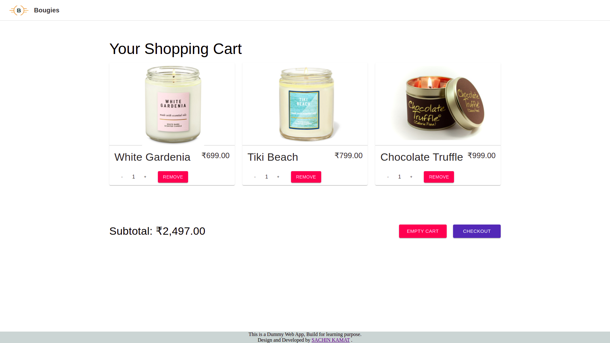
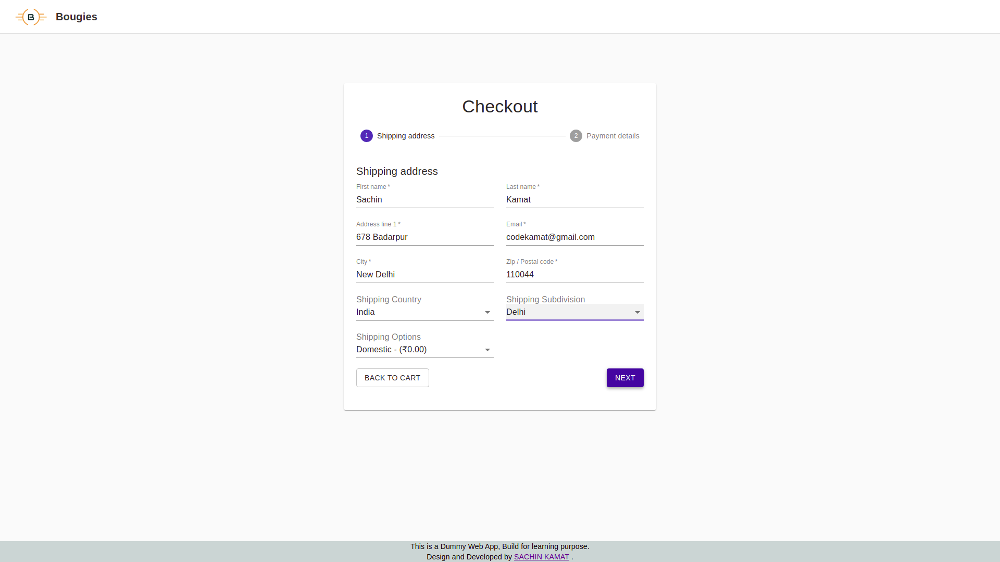
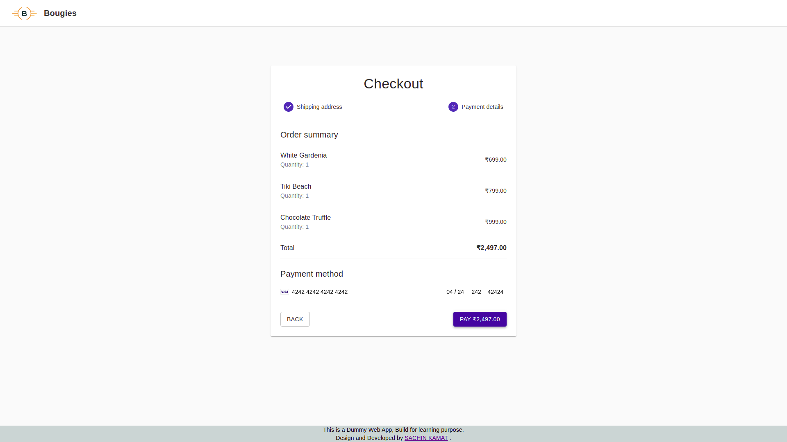
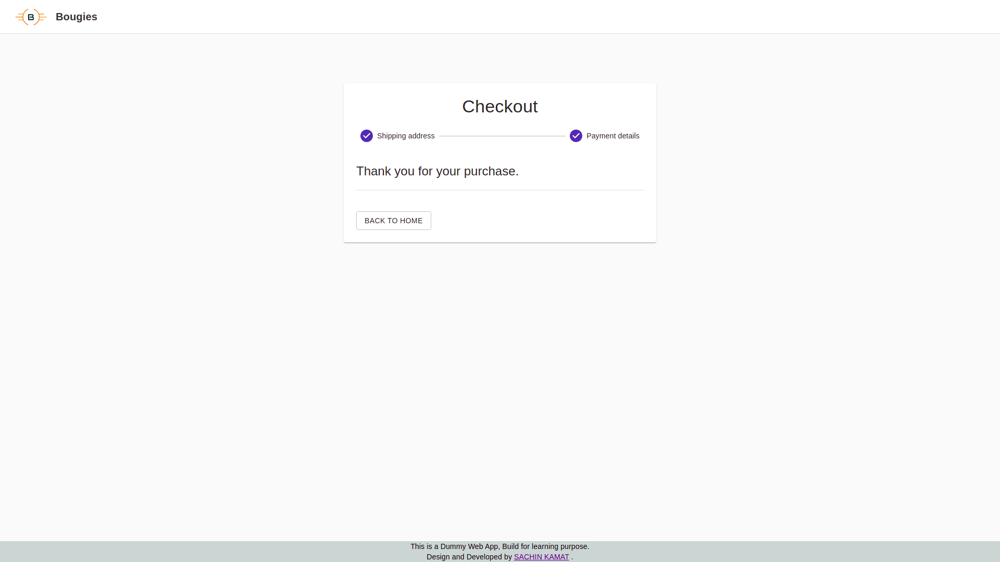

# Bougies

#### See Live Site: <https://bougies.netlify.app/>

#### Description:

An E-Commerce for scented candles, Bougies is a web app implemented using react.js commerce.js and stripe that work like a e-commerce.

Customers can visit web stores from the comfort of their homes and shop as they sit in front of the computer.

Customers can buy a variety of scented candles from online store. The main objective of this project is to design a dynamic, responsive E-commerce website.

This project aims at developing a highly cost-effective E-commerce website for a scented candles.

Customers can easily search products and make their own carts and can pay online, as we provide secure online transactions.

Data Security is maintained to a relatively high level by implementing it at the Database level, so as to ensure that only admin have access to confidential client information.

The following functionalities have been added to the app-

- ADD PRODUCT:
- CART:
- CHECKOUT:
- PAYMENT GATWAY

#### How to develop it

- Clone on your local machine by using `git@github.com:codeKAMAT/Bougies.git`
- Navigate into the main directory
- Run `npm install` to install node modules
- Run `npm start` to run it locally then will open automatclly on your browser on `localhost:3000` port
- Run `npm run build` to create a production build

#### Tech Stack-

- React
- Commerce.js
- Material UI
- Stripe

#### Screens :computer:

